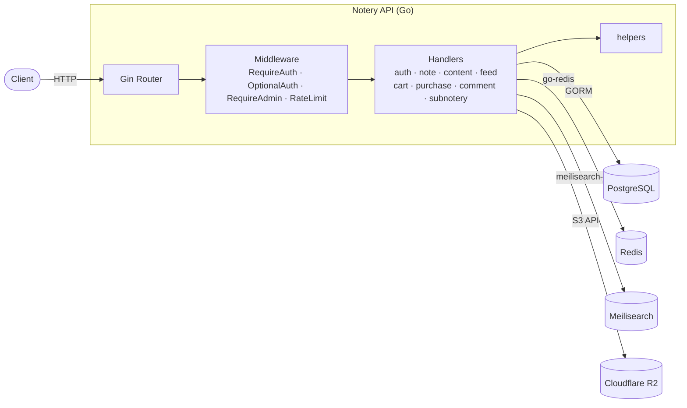
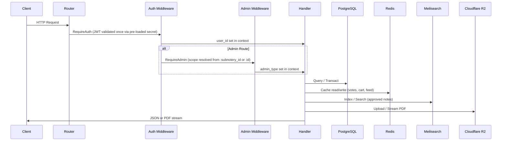

# Notery

Notery is a marketplace for notes — a RESTful API built with Go that allows users to create, share, and purchase notes within communities called "subnoteries."


## Features

- **User Authentication** — JWT-based signup/login; secret loaded once at startup; optional public `username` display name
- **Note Management** — Create, view, approve, reject, and delete notes with typed status constants
- **PDF Content** — Secure upload, proxy-only viewing, and access-controlled streaming via Cloudflare R2
- **Subnoteries** — Community-based note organisation with scoped admin controls
- **Shopping Cart** — Redis-backed cart system for purchasing notes
- **Purchases & Orders** — Order state machine (pending → paid → fulfilled), idempotency-key support, int64 cent-based prices
- **Voting & Hot Feed** — Reddit-style hotness algorithm; DB-authoritative votes table with Redis cache
- **Comment System** — Threaded Reddit-style comments with Wilson score ranking, soft-delete, write-depth limits, and per-comment voting
- **Rate Limiting** — Redis-backed sliding-window per-user rate limiting on all write endpoints (60 req/min)
- **Full-Text Search** — Meilisearch integration for approved notes
- **Role-Based Access** — Global admins, subnotery-scoped admins, creators, and purchasers

## Tech Stack

| Component  | Technology                                          |
| ---------- | --------------------------------------------------- |
| Language   | Go 1.25+                                            |
| Framework  | [Gin](https://github.com/gin-gonic/gin)             |
| Database   | PostgreSQL 16 (via GORM)                             |
| Cache      | Redis 7                                              |
| Search     | [Meilisearch](https://www.meilisearch.com/)          |
| Storage    | Cloudflare R2 (S3-compatible)                        |
| Auth       | JWT (HS256)                                          |

## Architecture Overview



### Request Flow



## Project Structure

```
Notery/
├── cmd/
│   └── api/
│       └── main.go              # Entrypoint — config, init, routing
├── internal/
│   ├── config/
│   │   └── config.go            # Centralised .env loading (once at startup)
│   ├── database/
│   │   ├── database.go          # PostgreSQL init + migrations
│   │   ├── redis.go             # Redis init
│   │   ├── meilisearch.go       # Meilisearch init
│   │   └── r2.go                # Cloudflare R2 client
│   ├── handlers/
│   │   ├── app.go               # Unified App struct (DB, Redis, R2, Meili, JWT)
│   │   ├── auth.go              # Signup / Login
│   │   ├── cart.go              # Cart CRUD (Redis set)
│   │   ├── comment.go           # Threaded comments, voting, tree assembly
│   │   ├── content.go           # PDF upload / view / delete + access control
│   │   ├── feed.go              # Hot feed, voting (DB tx + Redis cache)
│   │   ├── note.go              # Note CRUD, approve/reject
│   │   ├── purchase.go          # Checkout, single purchase, history
│   │   └── subnotery.go         # Join subnotery, add admin
│   ├── helpers/
│   │   ├── helpers.go           # Pagination, logging, binding, auth context
│   │   ├── cart.go              # Cart Redis key builder
│   │   ├── note.go              # Note fetch/parse helpers
│   │   ├── subnotery.go         # Subnotery fetch/parse helpers
│   │   └── user.go              # User fetch helpers
│   ├── middleware/
│   │   ├── auth.go              # RequireAuth / OptionalAuth (JWT factory fns)
│   │   ├── admin.go             # RequireAdmin (global or subnotery-scoped)
│   │   └── ratelimit.go         # Per-user sliding-window rate limiter (Redis)
│   └── models/
│       ├── comment.go           # Comment + CommentVote + Wilson score
│       ├── note.go              # Note + NoteStatus enum
│       ├── order.go             # Order + OrderItem + OrderStatus enum
│       ├── purchase.go          # Purchase record
│       ├── subnotery.go         # Subnotery (community)
│       ├── user.go              # User + bcrypt auth + DisplayName
│       └── vote.go              # Vote + VoteDirection enum
├── docs/
│   └── PDF_CONTENT_SYSTEM.md    # Detailed PDF architecture docs
├── scripts/
│   ├── test-hot-feed.ps1        # Hot feed end-to-end test
│   ├── test-pdf-workflow.ps1    # PDF upload/purchase workflow test
│   └── test-comments.ps1        # Comment system end-to-end test
├── docker-compose.yml
├── go.mod
└── README.md
```

## Getting Started

### Prerequisites

- Go 1.25 or later
- Docker & Docker Compose (for local services)

### Environment Variables

Create a `.env` file in the project root:

```env
# PostgreSQL
DB_HOST=localhost
DB_PORT=5432
DB_USER=admin
DB_PASSWORD=yourpassword
DB_NAME=notery_db
DB_SSLMODE=disable
DB_TIMEZONE=UTC

# Redis
REDIS_ADDR=localhost:6379
REDIS_PASSWORD=yourredispassword
REDIS_DB=0

# Meilisearch
MEILISEARCH_HOST=http://localhost:7700
MEILISEARCH_MASTER_KEY=yourmeilisearchkey
MEILISEARCH_INDEX=notes

# Cloudflare R2
R2_ACCOUNT_ID=your_cloudflare_account_id
R2_ACCESS_KEY_ID=your_r2_access_key
R2_SECRET_ACCESS_KEY=your_r2_secret_key
R2_BUCKET_NAME=notery-pdfs

# JWT
JWT_SECRET=your-super-secret-key
```

### Running Locally

1. **Start infrastructure services:**

   ```bash
   docker-compose up -d
   ```

2. **Run the API:**

   ```bash
   go run cmd/api/main.go
   ```

3. **Verify the server is running:**

   ```bash
   curl http://localhost:8080/health
   ```

## API Endpoints

### Public

| Method | Endpoint         | Description        |
| ------ | ---------------- | ------------------ |
| GET    | `/health`        | Health check       |
| POST   | `/api/v1/signup` | Register (`email`, `password`, optional `username`) |
| POST   | `/api/v1/login`  | Authenticate user  |

### Public (Optional Auth)

| Method | Endpoint                           | Description                                                  |
| ------ | ---------------------------------- | ------------------------------------------------------------ |
| GET    | `/api/v1/feed/hot`                 | Hot feed (personalised if authenticated)                     |
| GET    | `/api/v1/notes/:id/comments`       | Threaded comment tree (Wilson ranked; user_vote if logged in) |
| GET    | `/api/v1/comments/:comment_id`     | Single comment subtree ("Continue this thread")              |

### Protected (Requires JWT)

| Method | Endpoint                            | Description                        |
| ------ | ----------------------------------- | ---------------------------------- |
| GET    | `/api/v1/notes/:id`                 | Get note by ID                     |
| POST   | `/api/v1/notes`                     | Create a new note                  |
| GET    | `/api/v1/notes/approved`            | List approved notes                |
| POST   | `/api/v1/notes/:id/content`         | Upload PDF (creator/admin only)    |
| GET    | `/api/v1/notes/:id/content`         | View/stream PDF (owner/purchaser)  |
| POST   | `/api/v1/notes/:id/upvote`          | Upvote a note                      |
| POST   | `/api/v1/notes/:id/downvote`        | Downvote a note                    |
| GET    | `/api/v1/cart`                      | View cart                          |
| POST   | `/api/v1/cart`                      | Add note to cart                   |
| DELETE | `/api/v1/cart/:item_id`             | Remove item from cart              |
| POST   | `/api/v1/checkout`                  | Checkout cart → create order       |
| POST   | `/api/v1/notes/:id/purchase`        | Direct "Buy Now" purchase          |
| GET    | `/api/v1/notes/:id/purchased`       | Check purchase status              |
| GET    | `/api/v1/me/purchases`              | List purchased notes               |
| GET    | `/api/v1/me/purchases/history`      | Paginated purchase history         |
| POST   | `/api/v1/subnoteries/:id/join`      | Join a subnotery                   |

### Comment Write Endpoints (Requires JWT + Rate Limited)

| Method | Endpoint                                | Description                                   |
| ------ | --------------------------------------- | --------------------------------------------- |
| POST   | `/api/v1/notes/:id/comments`            | Create top-level comment or reply              |
| PUT    | `/api/v1/comments/:comment_id`          | Edit own comment                               |
| DELETE | `/api/v1/comments/:comment_id`          | Soft-delete own comment (admin: any in scope)  |
| POST   | `/api/v1/comments/:comment_id/vote`     | Vote on comment (+1/-1, toggle, switch)        |
| DELETE | `/api/v1/comments/:comment_id/vote`     | Remove vote from comment                       |

### Admin Only (Global or Subnotery-Scoped)

| Method | Endpoint                                   | Description              |
| ------ | ------------------------------------------ | ------------------------ |
| GET    | `/api/v1/notes/pending`                    | List pending notes       |
| PATCH  | `/api/v1/notes/:id/approve`                | Approve a note           |
| PATCH  | `/api/v1/notes/:id/reject`                 | Reject a note            |
| DELETE | `/api/v1/notes/:id`                        | Delete a note            |
| GET    | `/api/v1/admin/notes/:id/preview`          | Preview PDF (admin)      |
| DELETE | `/api/v1/admin/notes/:id/content`          | Delete PDF content       |
| POST   | `/api/v1/subnoteries/:id/admins`           | Add admin to subnotery   |

## Data Models

### Key Domain Types

| Model       | Key Fields                                                         |
| ----------- | ------------------------------------------------------------------ |
| `Note`      | `ID`, `CreatorID`, `Title`, `Author`, `Status` (enum), `Price` (int64 cents), `SubnoteryID`, `HasPDF`, `Upvotes`, `Downvotes`, `Hotness` |
| `User`      | `ID`, `Email`, `Username`, `Hash` (bcrypt), `IsGlobalAdmin`, `AdminOf` (m2m)  |
| `Comment`   | `ID`, `NoteID`, `UserID`, `ParentID`, `Body`, `Upvotes`, `Downvotes`, `Score` (Wilson), `Depth`, `IsDeleted`, `EditedAt` |
| `CommentVote` | `ID`, `CommentID`, `UserID` (composite unique), `Value` (+1/-1) |
| `Purchase`  | `ID`, `UserID`, `NoteID`, `PricePaid` (int64 cents), `PurchasedAt`|
| `Order`     | `ID`, `UserID`, `Status` (enum), `TotalCents`, `IdempotencyKey` (per-user unique), `Items[]` |
| `OrderItem` | `ID`, `OrderID`, `NoteID`, `PriceCents`                           |
| `Vote`      | `ID`, `UserID`, `NoteID` (composite unique), `Direction` (enum)   |
| `Subnotery` | `ID`, `Name`, `Admins` (m2m), `Members` (m2m)                     |

### Status Enums

```
NoteStatus:       StatusPending  | StatusApproved   | StatusRejected
OrderStatus:      OrderPending   | OrderPaid        | OrderFulfilled | OrderFailed | OrderRefunded
VoteDirection:    VoteUp         | VoteDown
CommentSortOrder: best           | new              | top            | controversial | old
```

## Design Decisions

### Prices in Cents (int64)

All monetary values are stored as `int64` cents (e.g., `499` = $4.99). This avoids floating-point rounding errors inherent to `float64` and is the industry standard for financial data.

### Centralised Config

Environment variables are loaded **once** at startup via `internal/config/config.go`. Middleware and handlers receive secrets through constructor injection — no per-request `godotenv.Load()` or `os.Getenv()` calls.

### DB-Authoritative Votes

The `votes` table is the source of truth for vote state. Each vote operation runs inside a single DB transaction that atomically updates both the `votes` row and the `notes` counter columns. Redis vote hashes are updated as a best-effort cache afterwards.

### Order State Machine

Purchases are backed by an `orders` table with a clear lifecycle (`pending → paid → fulfilled`). The `idempotency_key` is scoped per-user via a composite unique index to prevent duplicate orders from retried requests without causing cross-user collisions.

### Subnotery-Scoped Admin Checks

The admin middleware resolves a subnotery ID from either `:subnotery_id` or by looking up the note's `subnotery_id` from `:id`. The scoped check ensures a subnotery admin of community A cannot perform admin actions on community B. When no subnotery context can be resolved, non-global admins are denied rather than granted fallback access.

### Comment System

Comments form a tree rooted at notes, assembled in O(n) time+space per request.

- **Ranking:** Wilson score lower bound (Reddit's "Best") — no time decay, quality always wins.
- **Voting:** Atomic vote updates with `SELECT … FOR UPDATE` to prevent counter drift during concurrent votes.
- **Soft-delete:** Deleted comments display `[deleted]` while preserving the tree so child replies remain visible.
- **Write depth cap:** `MaxWriteDepth = 15` prevents DoS via pathologically deep chains.
- **Read depth cap:** `MaxTreeDepth = 10` with `has_more_replies` flag for "Continue this thread →".
- **Privacy:** Comments display `username` (public handle), never email.
- **Public reads:** Comment listing is publicly readable (no auth required); authenticated users get `user_vote` attached.
- **Truncation flag:** Response includes `truncated: true` when the hard cap (2 000 comments) is exceeded.

### Rate Limiting

All write (mutating) endpoints are rate-limited via a Redis-backed sliding-window counter: 60 requests per minute per authenticated user (per IP for anonymous). The middleware sets standard `X-RateLimit-Limit` and `X-RateLimit-Remaining` headers. If Redis is down, the limiter fails open.

### PDF Upload Authorization

Only the note's creator or an admin (subnotery or global) can upload PDF content to a pending note. This prevents content hijacking where a malicious user could replace someone else's pending upload.

## Testing

```bash
# Unit tests
go test ./...
```

### Integration test scripts (requires running server + infrastructure)

```powershell
# Hot feed pipeline (signup, note, PDF, approve, vote, feed)
.\scripts\test-hot-feed.ps1

# PDF upload, purchase, and viewing workflow
.\scripts\test-pdf-workflow.ps1

# Full comment system (threads, votes, depth limits, admin delete, rate limiting)
.\scripts\test-comments.ps1
```

## License

Copyright (c) 2026 Jeter Pontes. All rights reserved.

This repository is proprietary. No permission is granted to use, copy, modify, or distribute this code without explicit written permission.
