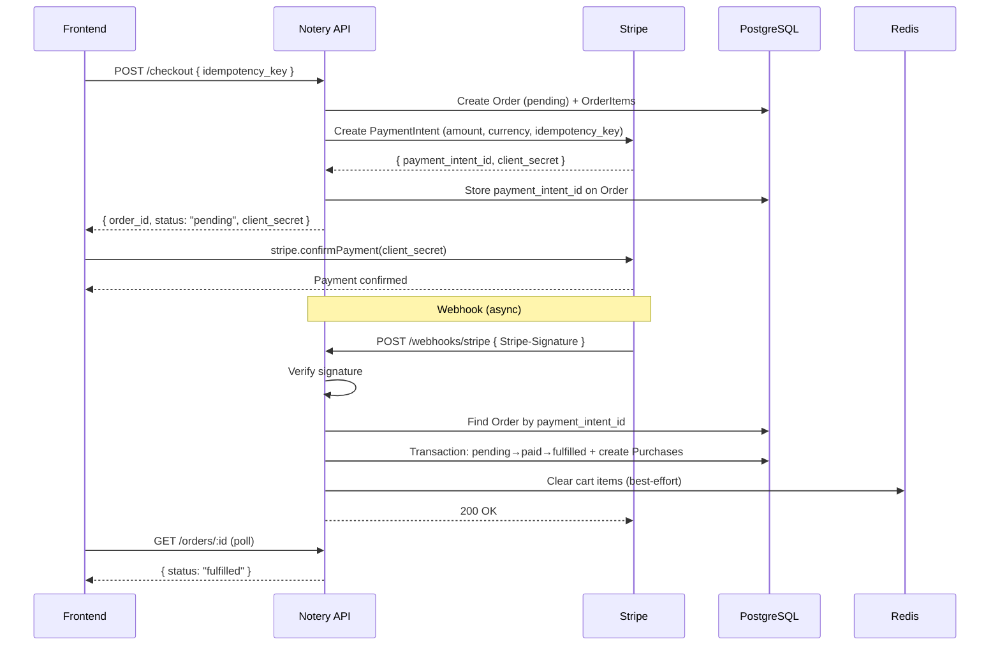
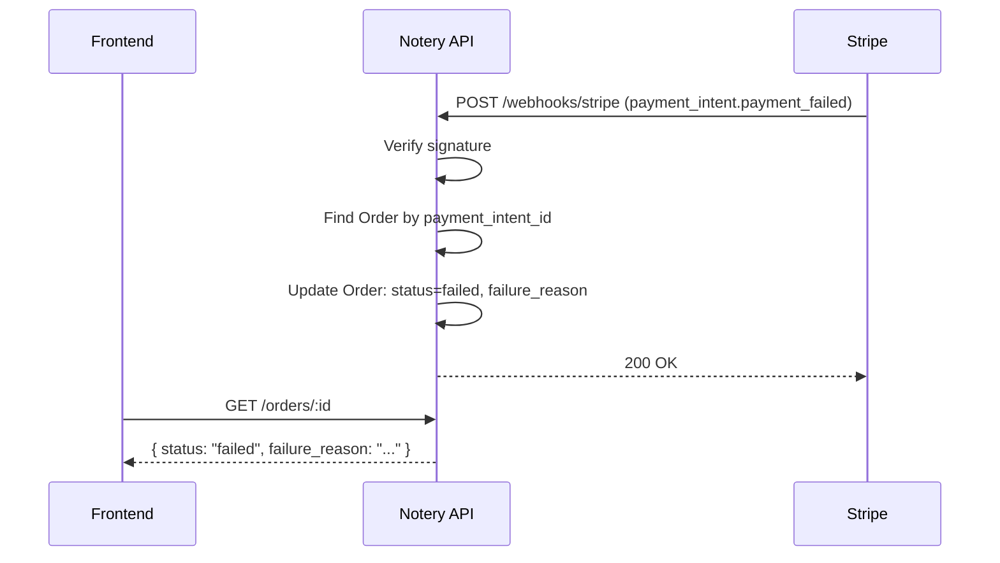
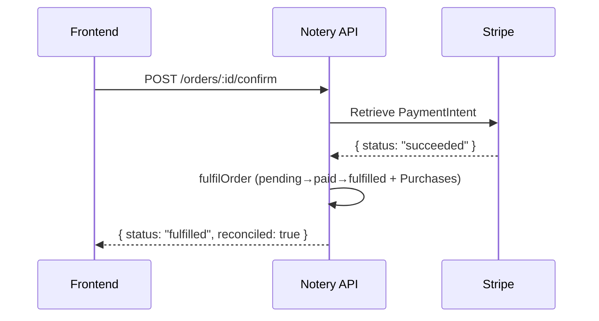

# Payment System Architecture

## Overview

Notery uses **Stripe** for payment processing. The integration follows a server-side PaymentIntent flow with webhook-based fulfilment, ensuring no purchases are granted without confirmed payment.

**Key principles:**
1. **Interface-driven** — handlers depend on `payment.Service`, not Stripe directly
2. **Webhook-authoritative** — purchases are only created when Stripe confirms payment
3. **Graceful fallback** — when Stripe is not configured, orders auto-fulfil (development mode)
4. **Idempotent everywhere** — webhooks, retries, and reconciliation are all safe to repeat
5. **Free orders bypass Stripe** — a $0 order is auto-fulfilled without creating a PaymentIntent

---

## Architecture Diagram

```
┌─────────────────────────────────────────────────────────────────────────────┐
│                              NOTERY API                                     │
├─────────────────────────────────────────────────────────────────────────────┤
│                                                                             │
│  ┌────────────────────────┐    ┌────────────────────────┐                  │
│  │   Purchase Handler      │    │   Webhook Handler       │                  │
│  │  (checkout, single buy) │    │  (POST /webhooks/stripe) │                  │
│  └───────────┬─────────────┘    └───────────┬─────────────┘                  │
│              │                              │                               │
│              │ payment.Service              │ payment.Service               │
│              │ .CreatePaymentIntent()       │ .VerifyWebhookSignature()     │
│              ▼                              ▼                               │
│  ┌─────────────────────────────────────────────────────────────────┐       │
│  │              payment.Service Interface                           │       │
│  │  CreatePaymentIntent · RetrievePaymentIntent · VerifyWebhook    │       │
│  └──────────┬────────────────────────────────────┬─────────────────┘       │
│             │                                    │                          │
│  ┌──────────▼──────────┐            ┌────────────▼────────────┐            │
│  │  StripeService       │            │  MockService (tests)     │            │
│  │  (production)        │            │  (unit tests)            │            │
│  └──────────┬──────────┘            └─────────────────────────┘            │
│             │                                                               │
└─────────────┼───────────────────────────────────────────────────────────────┘
              │
              │ HTTPS (Stripe API)
              ▼
    ┌───────────────────┐
    │    Stripe API       │
    │  PaymentIntents     │
    │  Webhooks           │
    └───────────────────┘
```

---

## Payment Flow

### Happy Path: Checkout → Payment → Fulfilment



### Failed Payment



### Reconciliation (Late Webhook)



---

## Order State Machine

```
                    ┌─────────┐
                    │ pending  │
                    └────┬─────┘
                         │
               ┌─────────┼─────────┐
               │                    │
               ▼                    ▼
          ┌─────────┐         ┌─────────┐
          │  paid    │         │ failed  │ (terminal)
          └────┬─────┘         └─────────┘
               │
               ▼
          ┌──────────┐
          │ fulfilled │
          └────┬──────┘
               │
               ▼
          ┌──────────┐
          │ refunded  │ (terminal)
          └──────────┘
```

**Valid transitions** (enforced by `models.IsValidTransition`):

| From        | To                       |
| ----------- | ------------------------ |
| `pending`   | `paid`, `failed`         |
| `paid`      | `fulfilled`, `refunded`  |
| `fulfilled` | `refunded`               |
| `failed`    | *(terminal)*             |
| `refunded`  | *(terminal)*             |

---

## API Endpoints

### Checkout

| Method | Endpoint                        | Auth     | Description                                 |
| ------ | ------------------------------- | -------- | ------------------------------------------- |
| POST   | `/api/v1/checkout`              | JWT      | Checkout cart → Order + PaymentIntent       |
| POST   | `/api/v1/notes/:id/purchase`    | JWT      | Single-note purchase                        |
| GET    | `/api/v1/orders/:order_id`      | JWT      | Poll order status                           |
| POST   | `/api/v1/orders/:order_id/confirm` | JWT   | Manual reconciliation (checks Stripe)       |

### Webhook

| Method | Endpoint                        | Auth              | Description                          |
| ------ | ------------------------------- | ----------------- | ------------------------------------ |
| POST   | `/api/v1/webhooks/stripe`       | Stripe-Signature  | Receives Stripe payment events       |

### Checkout Response (Payment Mode)

```json
{
  "order_id": 42,
  "status": "pending",
  "total_cents": 1998,
  "client_secret": "pi_xxx_secret_xxx",
  "payment_intent_id": "pi_xxx"
}
```

### Checkout Response (Auto-Fulfil / Dev Mode)

```json
{
  "order_id": 42,
  "status": "fulfilled",
  "purchased_count": 2,
  "total_cents": 1998
}
```

---

## Configuration

### Environment Variables

```env
# Stripe API Key (required for real payments)
# Use sk_test_xxx for development, sk_live_xxx for production
STRIPE_SECRET_KEY=sk_test_xxx

# Stripe Webhook Signing Secret (from Stripe Dashboard → Webhooks)
STRIPE_WEBHOOK_SECRET=whsec_xxx
```

When `STRIPE_SECRET_KEY` is not set, the system logs an info message and auto-fulfils all orders without payment.

### Stripe Dashboard Setup

1. Create a Stripe account at [stripe.com](https://stripe.com)
2. Get your API keys from Dashboard → Developers → API keys
3. Create a webhook endpoint:
   - URL: `https://your-domain.com/api/v1/webhooks/stripe`
   - Events to listen for:
     - `payment_intent.succeeded`
     - `payment_intent.payment_failed`
4. Copy the webhook signing secret (`whsec_xxx`)

---

## Code Structure

```
internal/
├── payment/
│   ├── payment.go       # Service interface, types, constants
│   ├── stripe.go        # Stripe implementation of Service
│   ├── mock.go          # Mock implementation for tests
│   └── payment_test.go  # Unit tests (interface compliance, mock, types)
├── handlers/
│   ├── purchase.go      # CheckoutCart, PurchaseSingleNote, fulfilOrder,
│   │                    # GetOrderStatus, ConfirmOrder, clearCartItems
│   └── webhook.go       # HandleStripeWebhook, handlePaymentSucceeded,
│                        # handlePaymentFailed
└── models/
    └── order.go         # Order model with PaidAt, FailedAt, FailureReason,
                         # IsValidTransition()
```

---

## Security

### Webhook Signature Verification

Every webhook request is verified using the Stripe-Signature header and the webhook signing secret. This prevents malicious actors from spoofing payment confirmations. The `payment.Service.VerifyWebhookSignature()` method handles this.

### Body Size Limit

Webhook payloads are limited to 64 KB (`maxWebhookBodySize`) to prevent denial-of-service via oversized payloads.

### No JWT on Webhook

The webhook endpoint is intentionally **public** (no JWT required). Authentication is handled by Stripe signature verification. This is the standard Stripe integration pattern.

### Idempotent Processing

- **Order creation**: Protected by the per-user composite unique idempotency key
- **Webhook processing**: Order status is checked before transitioning — duplicate webhooks are acknowledged without re-processing
- **PaymentIntent creation**: The idempotency key is forwarded to Stripe, preventing duplicate charges on retried requests

### Reconciliation Protection

The `POST /orders/:order_id/confirm` endpoint:
- Only allows the order owner to reconcile (no cross-user access)
- Checks the real PaymentIntent status with Stripe (not trusting client claims)
- Is idempotent (already-fulfilled orders return success)

---

## Development Mode

When `STRIPE_SECRET_KEY` is not set:

1. All orders auto-fulfil immediately (pending → paid → fulfilled in one transaction)
2. Purchases are created synchronously during checkout
3. The webhook endpoint returns 503 Service Unavailable
4. No Stripe API calls are made

This preserves the original development workflow while the full payment flow is used in production.

---

## Error Handling

| Scenario                        | HTTP Status | Stripe Retries? | User Impact                  |
| ------------------------------- | ----------- | --------------- | ---------------------------- |
| Stripe API down during checkout | 502         | N/A             | "Failed to initiate payment" |
| Webhook signature invalid       | 401         | Yes             | None (order stays pending)   |
| DB error during fulfilment      | 500         | Yes             | Order fulfilled on retry     |
| Order already fulfilled         | 200         | No              | None (idempotent)            |
| Unknown webhook event type      | 200         | No              | None (acknowledged)          |
| Payment canceled                | 200         | No              | Order marked as failed       |

---

## Testing

### Unit Tests (no Stripe key required)

```bash
go test ./internal/payment/... -v
go test ./internal/models/... -v
```

Tests cover:
- Service interface compliance (StripeService and MockService)
- Mock service default behaviour and custom overrides
- Call tracking for test assertions
- Error simulation
- Order status constants and valid transitions
- State machine validation (including self-transitions)

### Integration Testing (with Stripe test keys)

Use Stripe CLI to test webhooks locally:

```bash
# Install Stripe CLI
# Forward webhooks to local server
stripe listen --forward-to localhost:8080/api/v1/webhooks/stripe

# In another terminal, trigger a test event
stripe trigger payment_intent.succeeded
```

### Manual Testing

```bash
# 1. Checkout (creates PaymentIntent)
curl -X POST http://localhost:8080/api/v1/checkout \
  -H "Authorization: Bearer $TOKEN" \
  -H "Content-Type: application/json" \
  -d '{"idempotency_key": "uuid-here"}'

# 2. Check order status
curl http://localhost:8080/api/v1/orders/1 \
  -H "Authorization: Bearer $TOKEN"

# 3. Manually reconcile (if webhook delayed)
curl -X POST http://localhost:8080/api/v1/orders/1/confirm \
  -H "Authorization: Bearer $TOKEN"
```

---

## Future Enhancements

1. **Refund Flow** — Integrate Stripe Refunds API; transition Order to `refunded`
2. **Subscription Model** — Recurring payments for time-limited note access
3. **Multi-Currency** — Read currency from subnotery/user preferences
4. **Payout to Creators** — Stripe Connect for marketplace payouts
5. **Payment Retry** — Allow users to retry failed orders with a new PaymentIntent
6. **Background Reconciliation** — Periodic job to reconcile stale pending orders
